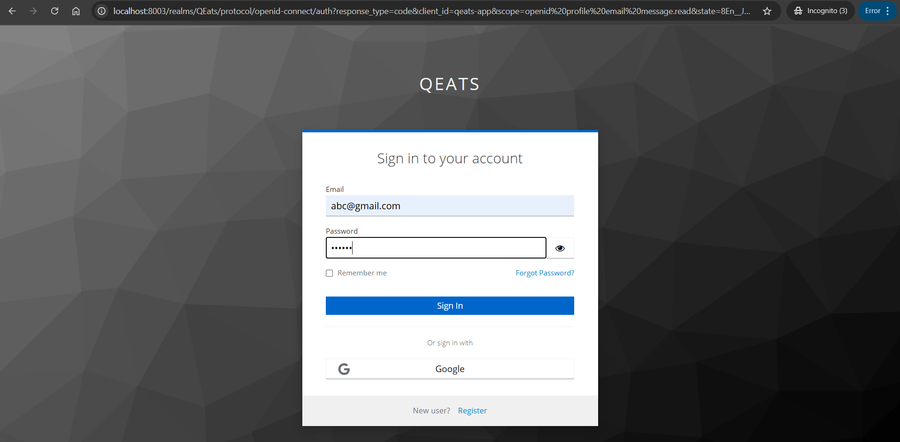

# **Food Ordering App** 🍔🍕🍜

An end-to-end food ordering application inspired by platforms like Swiggy, designed to provide seamless restaurant browsing, cart management, and order tracking.

---

## **Table of Contents**
1. [About the Project](#about-the-project)
2. [Features](#features)
3. [Technologies Used](#technologies-used)
4. [Getting Started](#getting-started)
5. [Installation](#installation)
6. [Usage](#usage)
7. [API Endpoints](#api-endpoints)
8. [Future Enhancements](#future-enhancements)
9. [Contributing](#contributing)
10. [Screenshots](#license)
11. [Acknowledgments](#acknowledgments)

---

## **About the Project**

This project is a full-stack implementation of a food ordering system, focusing on a modular microservices architecture. It allows users to:
- Browse restaurants and menus.
- Add items to their cart.
- Place and track orders in real-time.
- Securely process payments.

The project was developed as part of my personal learning journey to explore modern development practices and tools.

---

## **Features**
- 🖜 **Restaurant Browsing**: Search for restaurants by name, cuisine, or location.
- 🛍️ **Cart Management**: Add, update, or remove items.
- 💳 **Payment Integration**: Checkout with secure payment gateways.
- 🍅 **Order Tracking**: Real-time order status updates.
- 🔒 **Secure Authentication**: User authentication using OAuth2 and JWT.

---

## **Technologies Used**
### **Frontend**:
- React.js
- Axios (for API calls)
- Redux for state management
- Material UI

### **Backend**:
- Spring Boot
- Microservices architecture
- Keycloak OAuth2 provider

### **Database**:
- MySQL

### **Messaging & Caching**:
- Kafka (for asynchronous communication)
- Redis (for caching)

---

## **Getting Started**

Follow these instructions to set up the project on your local machine for development and testing.

---

## **Installation**

1. **Clone the repository**:
   ```bash
   git clone https://github.com/your-username/food-ordering-app.git
   cd food-ordering-app
   ```

2. **Backend Setup**:
   - Install Java and Maven.
   - Navigate to the `backend` directory:
     ```bash
     docker-compose up -d
     cd backend
     mvn clean install
     ```
   - Run the application:
     ```bash
     mvn spring-boot:run
     ```

3. **Frontend Setup**:
   - Install Node.js and npm.
   - Navigate to the `frontend` directory:
     ```bash
     cd frontend
     npm install
     npm start
     ```

---

## **Usage**

1. Start the backend and frontend servers.
2. Open the frontend in your browser at `http://localhost:3000/home`.
3. Browse restaurants, add items to the cart, and place orders!

---

## **API Endpoints**

### **Restaurant APIs**
- `GET /api/restaurant/cuisines/filter` - Fetch filtered cuisines.
- `GET /api/restaurant` - Fetch restaurant data.
- `POST /api/restaurant` - Create a new restaurant.
- `DELETE /api/restaurant/25` - Delete restaurant with ID 25.
- `PUT /api/restaurant/25` - Update restaurant with ID 25.

### **User APIs**
- `GET /api/user/77055c49-2dfe-4aec-8f15-406a09289e34/cart/1` - Fetch cart details.
- `PUT /api/user/77055c49-2dfe-4aec-8f15-406a09289e34/cart/1` - Update cart item.
- `GET /api/user/77055c49-2dfe-4aec-8f15-406a09289e34/profile` - Fetch user profile.
- `PUT /api/user/77055c49-2dfe-4aec-8f15-406a09289e34/profile` - Update user profile.
- `POST /api/user/77055c49-2dfe-4aec-8f15-406a09289e34/address` - Add a new address.
- `GET /api/user/77055c49-2dfe-4aec-8f15-406a09289e34/address` - Fetch all addresses.
- `PUT /api/user/77055c49-2dfe-4aec-8f15-406a09289e34/address` - Update an address.

### **Order APIs**
- `GET /orders` - Fetch all orders.
- `POST /orders/process` - Process a new order.
- `GET /orders/restaurants/active?restaurantIds=12,32` - Fetch active orders for restaurants.

### **Miscellaneous APIs**
- `GET /api/restaurant/user/77055c49-2dfe-4aec-8f15-406a09289e34` - Fetch user-specific restaurant data.
- `GET /refresh` - Refresh token.
- `GET /info` - Fetch application info.
- `GET /payment/create` - Create a payment.


---

## **Future Enhancements**
- Add user reviews and ratings for restaurants.
- Optimize for mobile-first experience.

---

## **Contributing**
Contributions are welcome! Please follow these steps:
1. Fork the repository.
2. Create your feature branch: `git checkout -b feature/YourFeature`.
3. Commit your changes: `git commit -m "Add some feature"`.
4. Push to the branch: `git push origin feature/YourFeature`.
5. Submit a pull request.

---

## **Screenshots**

### **1. Home Page**
*Description*: Displays the main landing page for the application. Users can search for cuisines or restaurants.


---

### **2. Login Page**
*Description*: Allows users to authenticate using OAuth2 or login credentials.



---

### **3. Post-Login Home Page**
*Description*: Displays the home page after user login, with additional options like profile and logout.


---

### **4. Search Results Page**
*Description*: Displays search results based on user queries, including filters by cuisine.


---

### **5. Restaurant Menu Page**
*Description*: Displays the selected restaurant's menu with options to add items to the cart.


---

### **6. Active Orders**
*Description*: Displays the list of active orders for the user.


---

### **7. Checkout Process**
*Description*: Shows the checkout process where users confirm their delivery details.


---

### **8. Payment Integration**
*Description*: Secure payment page with PayPal integration.


---

### **9. Manage Restaurant Dashboard**
*Description*: Dashboard for restaurant owners to manage their listings and view active orders.


---

### **10. User Profile Page**
*Description*: Allows users to view and update their profile information.


---


## **Acknowledgments**
- Inspiration: Swiggy, Zomato
- Tools: Spring Boot, React, Kafka, Redis, Docker
